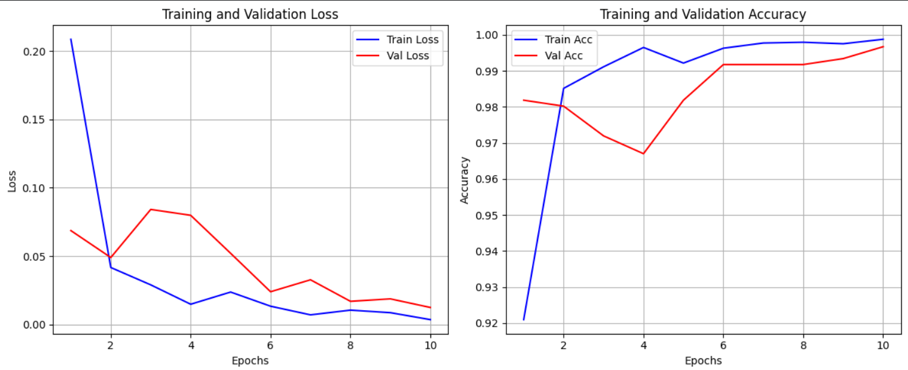

# Brain Tumor Classification using Deep Learning


An automated diagnostic system designed to classify brain tumors from MRI scans into three distinct categories. This project leverages Transfer Learning to achieve high precision in medical image analysis.

## Owerview
**TL;DR:** This project implements a deep convolutional neural network to classify brain MRI images into three classes: `Glioma`, `Meningioma`, and `Pituitary Tumor`. Utilizing the **ResNet-18** architecture with transfer learning, the model achieved a final test accuracy of **99.83%**.

---

## Problem Statement
The primary goal of this project is to assist medical professionals by providing an automated tool for the preliminary classification of brain tumors. Accurate and fast classification is crucial for determining the treatment plan and improving patient outcomes.

**Key Challenges:**
- **High Intra-class Similarity:** Different tumor types can exhibit similar visual patterns in MRI scans.
- **Medical Precision:** In medical imaging, minimizing False Negatives is critical.
- **Data Consistency:** Ensuring the model is robust against variations in image contrast and orientation.

---

## Dataset & Preprocessing

### Dataset Description
- **Total Images:** 6,056
- **Classes:** 
  - 🔴 `Glioma`
  - 🔵 `Meningioma`
  - 🟢 `Pituitary Tumor`
- **Data Source:** Brain Cancer MRI Dataset.

### Data Pipeline
To ensure the model generalizes well and avoids overfitting, the following pipeline was implemented:

1. **Stratified Data Split:** To maintain the class distribution across all sets:
   -  **Train:** 80%
   -  **Validation:** 10%
   -  **Test:** 10%
2. **Preprocessing:**
   - **Resizing:** All images resized to `224x224` pixels to match the model input.
   - **Normalization:** Pixel values normalized using ImageNet mean and standard deviation.
   - **Color Space:** Forced conversion to RGB to ensure consistency across all files.
3. **Online Augmentation:** To increase model robustness, the following transforms were applied during training:
   - `RandomHorizontalFlip()`
   - `RandomRotation(10°)`

---

## Architecture & Methodology

### Model Selection
The **ResNet-18** (Residual Network) architecture was selected as the backbone. 

**Reasoning:**
- **Residual Connections:** Prevents the vanishing gradient problem, allowing for more stable training.
- **Efficiency:** Provides an optimal trade-off between computational cost (inference speed) and predictive accuracy.
- **Transfer Learning:** The model was initialized with weights pre-trained on ImageNet and fine-tuned on MRI scans.

### Hyperparameters
| Parameter | Value |
| :--- | :--- |
| **Optimizer** | Adam |
| **Learning Rate** | 0.001 |
| **Loss Function** | CrossEntropyLoss |
| **Batch Size** | 64 |
| **Epochs** | 10 |
| **Device** | CUDA (GPU) |

---

## 📈 Results

### Performance Metrics
| Metric | Training Set | Validation Set | Test Set |
| :--- | :---: | :---: | :---: |
| **Accuracy** | **99.88%** | **99.67%** | **99.83%** |

### Learning Curves
<p align="center">
  
</p>

*The convergence of training and validation loss indicates that the model is well-generalized and not overfitting.*

---

## Installation & Usage

### Prerequisites
- Python 3.8+
- PyTorch & Torchvision
- Scikit-learn
- Matplotlib & Seaborn

### Quick Start
1. **Clone the repository:**
   ```bash
   git clone https://github.com/[your_username]/[your_repo_name].git
   cd [your_repo_name]
   ```
